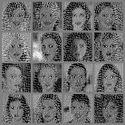
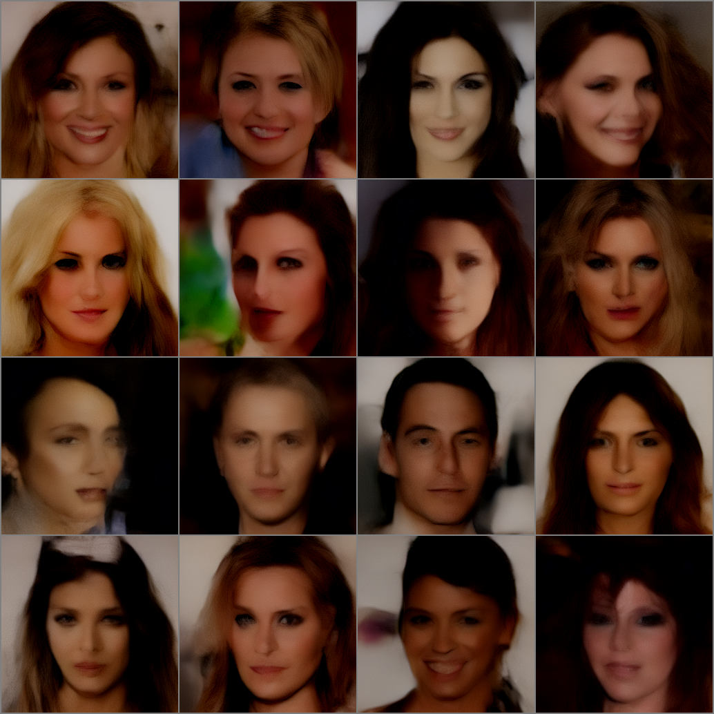
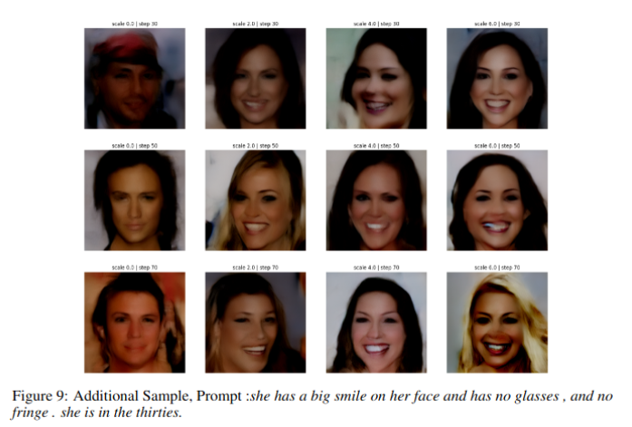

# Text Conditioned Image Synthesis using Latent Diffusion Models (LDM)

This project demonstrates how to train a text-conditioned Latent Diffusion Model (LDM) using the [CelebA-Dialog](https://github.com/ziqihuangg/CelebA-Dialog) dataset. For a detailed explanation of methodology, training setup, and results, see: 📄 [Report (PDF)](LDM_final.pdf)

---

## Results

# Sample Latent and corresponding Reconstruction:

<table>
  <tr>
    <td align="center"><b>Latents</b></td>
    <td align="center"><b>Reconstruction</b></td>
  </tr>
  <tr>
    <td></td>
    <td></td>
  </tr>
</table>

---

# Text-Conditioned Generation

Given a prompt, the LDM generates images by denoising in the latent space and decoding through the VAE.

## Model

- **Encoder:** Pretrained CompVis/stable-diffusion-v1-4
- **Text Encoder:** Pretrained CLIP (openai/clip-vit-large-patch14)
- **Diffusion Model:** Trained

---

## 📦 Processed Stuff
- Preprocessed images and captions from CelebA-Dialog are used for training
- 👉 [Kaggle Dataset](https://huggingface.co/datasets/Om2005Prakash/CelebA_Dialogue_Precomputed/tree/main)
- Precomputed latents and tokenized captions are hosted here (This will save a LOT of time):
  👉 [Hugging Face Dataset](https://huggingface.co/datasets/Om2005Prakash/CelebA_Dialogue_Precomputed/tree/main)
